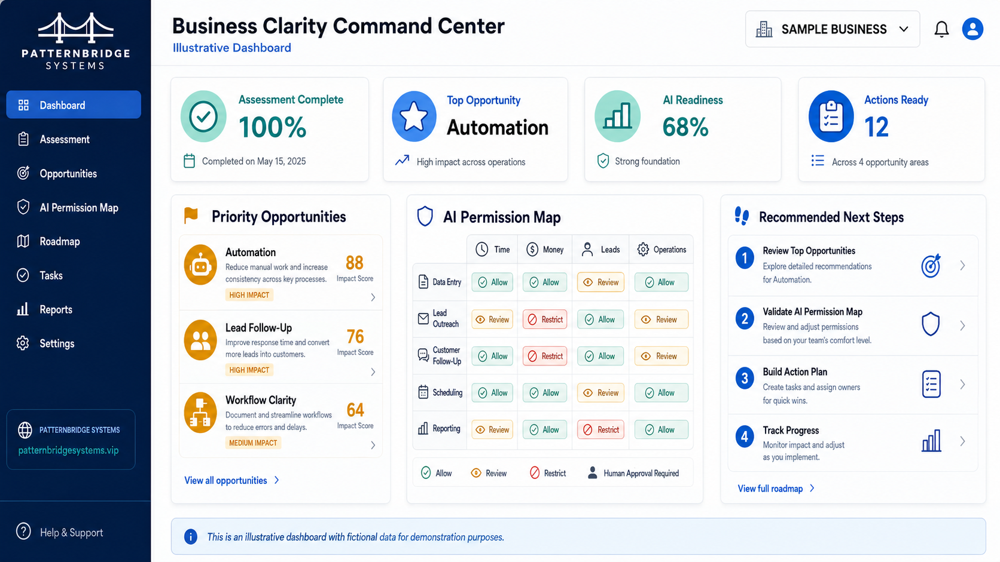
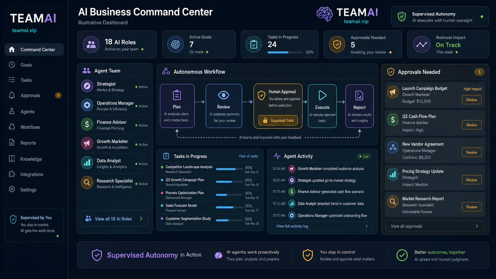
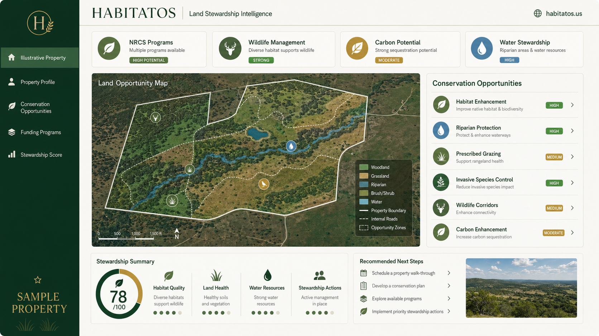
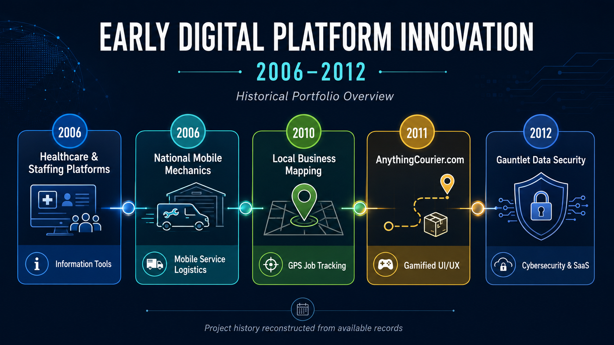
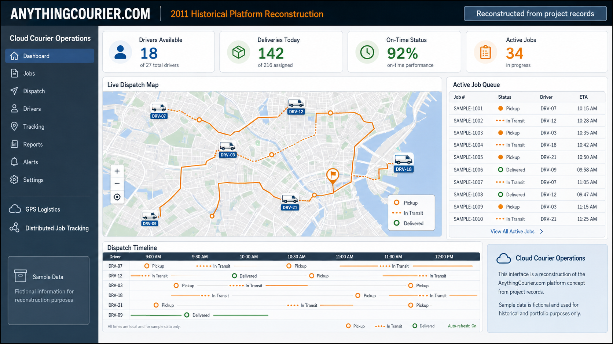
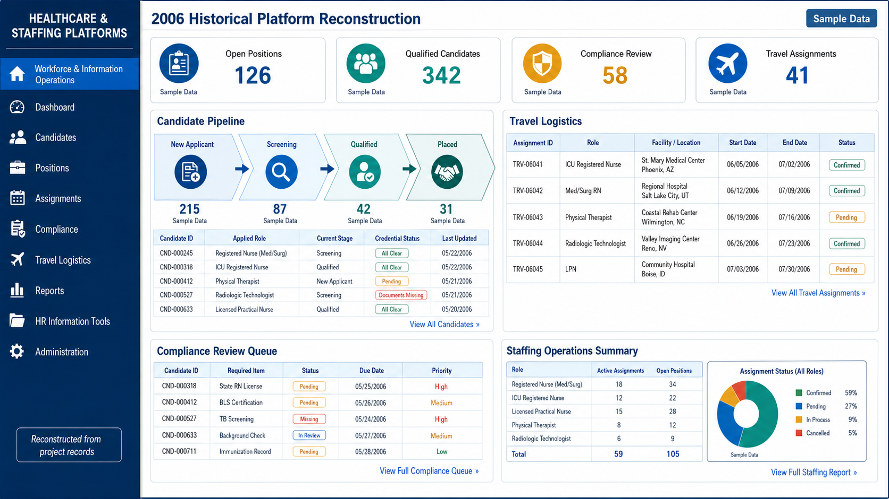
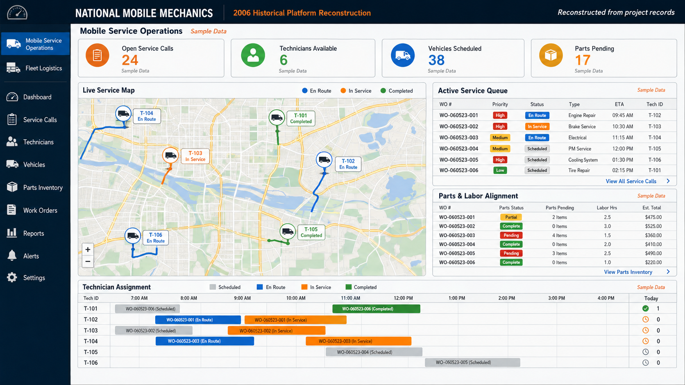
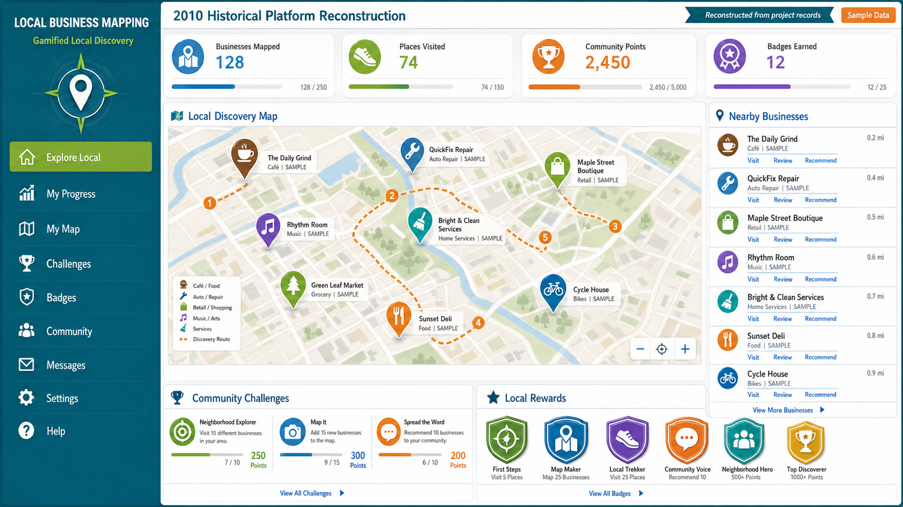
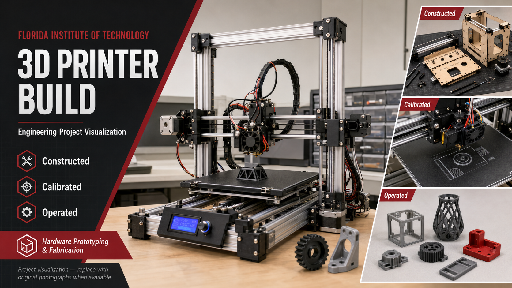

# Clint Hill

## Systems, Operations, and Responsible AI

I help turn fragmented workflows, technology uncertainty, and manual operating work into practical systems that support clearer decisions, stronger execution, and responsible AI adoption.

I am the founder of [PatternBridge Systems](https://patternbridgesystems.vip), where I focus on practical AI opportunity assessment, workflow improvement, operating controls, and implementation support for small and mid-sized businesses.

## Current Focus

| Area | What I work on |
|---|---|
| **AI operations** | Practical ways to identify workflow opportunities, clarify permissions, and introduce appropriate human review. |
| **Business systems** | Process mapping, operating visibility, requirements, documentation, and implementation planning. |
| **Execution** | Cross-functional delivery, stakeholder alignment, risk awareness, and usable decision support. |

## Portfolio Priorities

### 1. [PatternBridge Systems](https://patternbridgesystems.vip)

> **Illustrative dashboard.** This owner-supplied visual uses fictional demonstration data to communicate a possible business-assessment and AI-governance experience. It is not a client dashboard, client result, or live customer system.

PatternBridge Systems is a business improvement, AI, and automation advisory focused on assessment, workflow improvement, operating controls, and implementation support for small and mid-sized businesses.

### 2. [TeamAI](https://teamai.vip)

> **Illustrative dashboard.** This owner-supplied visual depicts a supervised-autonomy concept using non-operational sample content. Human review and approval remain central to the intended operating model.

TeamAI is an AI executive-team workspace for founders, consultants, and operators who need coordinated specialist support, task execution, and delivery assets.

### 3. [HabitatOS](https://habitatos.us)

> **Illustrative property dashboard.** This owner-supplied visual contains sample property and opportunity content. It is not a live assessment, site-specific recommendation, conservation determination, or an offer of funding.

HabitatOS is a Texas-focused land-stewardship platform for property intelligence, conservation opportunity management, and decision support.

## Historical Digital Innovation, 2006–2012

> **Historical portfolio overview.** This timeline was reconstructed from available project records. It summarizes early digital platform concepts and does not represent currently operating services, retained production systems, or independently audited historical records.

### AnythingCourier.com — 2011 Historical Platform Reconstruction

> **Historical reconstruction.** This owner-supplied visual was reconstructed from project records for portfolio context. The map, drivers, jobs, operating metrics, and all other interface data are fictional sample content; it does not represent a live logistics platform or historical operational data.

<strong>View individual historical platform reconstructions</strong>

### Healthcare & Staffing Platforms — 2006

> **Historical reconstruction with sample data.** This owner-supplied visual is reconstructed from project records for portfolio context. It does not contain customer, candidate, facility, assignment, credential, compliance, or other production data.

### National Mobile Mechanics — 2006

> **Historical reconstruction with sample data.** This owner-supplied visual is reconstructed from project records for portfolio context. It does not represent a current mobile-service operation, dispatch system, fleet, workforce, or service data.

### Local Business Mapping — 2010

> **Historical reconstruction with sample data.** This owner-supplied visual is reconstructed from project records for portfolio context. It does not represent a current directory, map product, business listing service, community, or user activity.

## Engineering and Prototype Work

### 3D-Printer Build Visualization

> **Owner-supplied project visualization.** This image is not an original photograph and should not be treated as independently verified proof of construction, calibration, operation, institutional affiliation, or project outcomes. Original photographs and contemporaneous project materials remain the appropriate evidence source when available.

## Selected Public Technical Work

| Project | Description | Status |
|---|---|---|
| [Virtual Patriot](https://github.com/cognizanteyez/virtual-patriot) | Historical IoT, edge-device, and cybersecurity systems-visualization prototype documentation. | Historical prototype |
| [Government Contract Opportunity Platform](https://github.com/cognizanteyez/Gov_Contract_Platform) | Flask-based prototype exploring authenticated opportunity discovery against public federal contracting data. | Prototype / learning project |
| [LSTM Stock Price Forecasting](https://github.com/cognizanteyez/Stock_Price_Next_Day_Open) | Learning project exploring time-series forecasting with PyTorch and LSTM models; it is not investment advice or a production trading system. | Learning project |

## Working Principles

I value practical implementation over hype, measurable operating improvement over unnecessary complexity, and responsible use of AI with clear human accountability.

Some work is anonymized or not publicly shared to respect client confidentiality, security, and commercial obligations. Public repositories are shared as learning artifacts, prototypes, technical evidence, or owner-supplied portfolio reconstructions. They should be evaluated on their individual documentation and stated limitations.

## Connect

| Resource | Link |
|---|---|
| PatternBridge Systems | [patternbridgesystems.vip](https://patternbridgesystems.vip) |
| TeamAI | [teamai.vip](https://teamai.vip) |
| HabitatOS | [habitatos.us](https://habitatos.us) |
| LinkedIn | [Clint Hill](https://www.linkedin.com/in/clinthill) |
